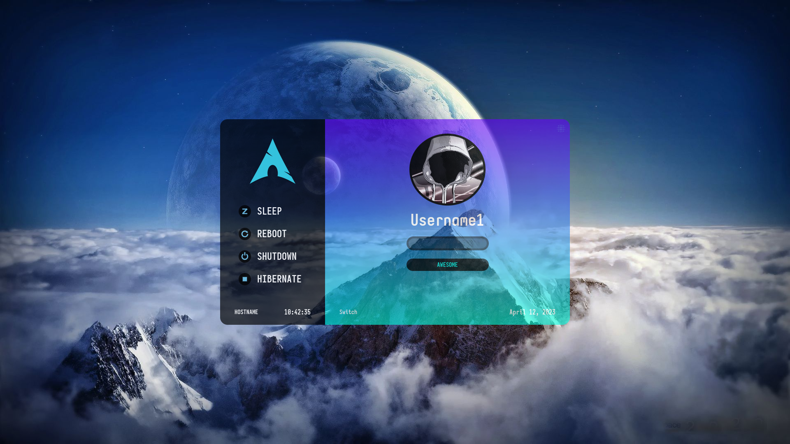
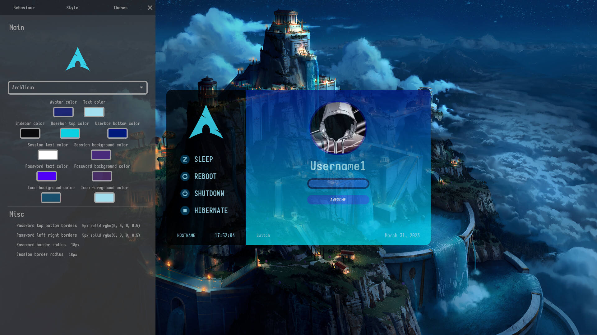
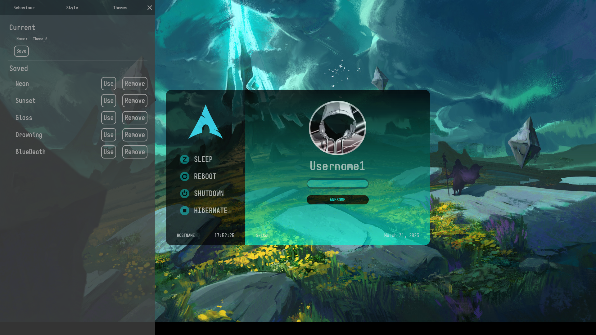
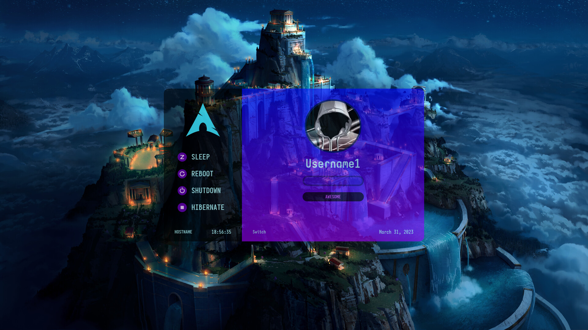

<h1 align="center">Shikai</h1>

    

Modern lightdm webkit2 theme

<h2 align="center">Description</h2>

This is a sleek lightdm webkit2 theme that focuses on it's looks with performance in mind.

<h2 align="center">Details</h2>

The theme features:

- Multi-monitor support!
- Custom time and date formats!
- Graphical on-theme behaviour configuration!
- Graphical on-theme styles configuration!
- Saving configurations as sub-themes!
- Sleek animations and on-hover effects!
- Background shuffle on background click!
- Idle login window auto-hiding at 60s of inactivity!
- Custom backgrounds configured via web-greeter.yml!
- Custom user images configured via a .face image on user home folders!

<h2 align="center">Live Demo</h2>

- Demo password: `password`

https://thewisker.github.io/Shikai

<h2 align="center">Screenshots</h2>

<h2 align="center">Dependencies</h2>

The theme depends on [web-greeter](https://github.com/JezerM/web-greeter) or [nody-greeter](https://github.com/JezerM/nody-greeter) and their respective dependencies, plus lightdm.

<h2 align="center">Installation</h2>

Once all dependencies are installed, you just need to download the [this](https://github.com/TheWisker/Shikai) github repo.

<h3>Script</h2>

To install using the script just execute the following bash files under ./scripts from the repo's root directory.

- `./scripts/w_install.sh` To install using web-greeter
- `./scripts/n_install.sh` To install using nody-greeter

Then, to set up a user profile image, copy the desired image to the user's home directory
renaming it to `.face`.

<h3>Arch Linux</h2>

To install using the aur with a custom aur helper run:

- `yay -S web-greeter-theme-shikai` Using `yay` aur helper for example

Then you should edit `/etc/lightdm/web-greeter.yml` 
to your liking focusing on the following lines:

- `theme: shikai`
- `background_images_dir: /usr/share/web-greeter/themes/shikai/assets/media/wallpapers/`
- `logo_image: /usr/share/web-greeter/themes/shikai/assets/media/logos/`

Then, to set up a user profile image, copy the desired image to the user's home directory
renaming it to `.face`.

<h3>Manually</h2>

Go to the `dist` folder and open the `index.html` and `monitor.html`files. Then find in both `window.__is_debug = true;`and change it to `window.__is_debug = false;`
Then copy the `dist` folder to `/usr/share/web-greeter/themes/`, renaming it from `dist` to `shikai`. Then you need to
change the line starting with `greeter-session=` in `/etc/lightdm/lightdm.conf` to `greeter-session=web-greeter` or 
`greeter-session=nody-greeter`, depending on which you have installed. You should edit `/etc/lightdm/web-greeter.yml` 
to your liking focusing on the following lines:

- `theme: shikai`
- `background_images_dir: /usr/share/web-greeter/themes/shikai/assets/media/wallpapers/`
- `logo_image: /usr/share/web-greeter/themes/shikai/assets/media/logos/`

Then, to set up a user profile image, copy the desired image to the user's home directory
renaming it to `.face`.

<h2 align="center">Configuration</h2>

The configuration becomes avaiable by hovering over the top-left corner of the window.
The behaviour and style settings are saved locally **only** when the configuration panel gets closed.
The themes configuration gets saved on theme creation, deletion and activation.

<h2 align="center">Discussions</h2>

Feel free to give any ideas for future improvements [here](https://github.com/TheWisker/Shikai/discussions/categories/ideas),
ask any questions you have [here](https://github.com/TheWisker/Shikai/discussions/categories/q-a) and
post screenshots of your theme designs [here](https://github.com/TheWisker/Shikai/discussions/2#discussion-5044383).

<h2 align="center">Notes</h2>

- Change wallpapers by adding or removing from `/usr/share/web-greeter/themes/shikai/assets/media/wallpapers/` path!
- Undefined behaviour for adding non-browser-compliant images and non-image files to the wallpapers directory!
- Missing linux distro logo? Submit a [pull request](https://github.com/TheWisker/Shikai/pulls)!
- Missing language? Submit a [pull request](https://github.com/TheWisker/Shikai/pulls)!
- Have a really cool wallpaper to add to the live demo? Submit a [pull request](https://github.com/TheWisker/Shikai/pulls)!

<h2 align="center">Author</h2>

    </img>

<h4 align="center">TheWisker</h4>