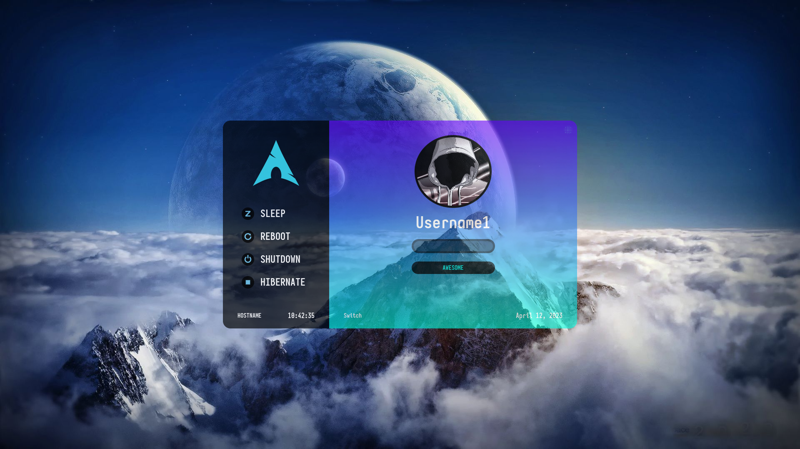
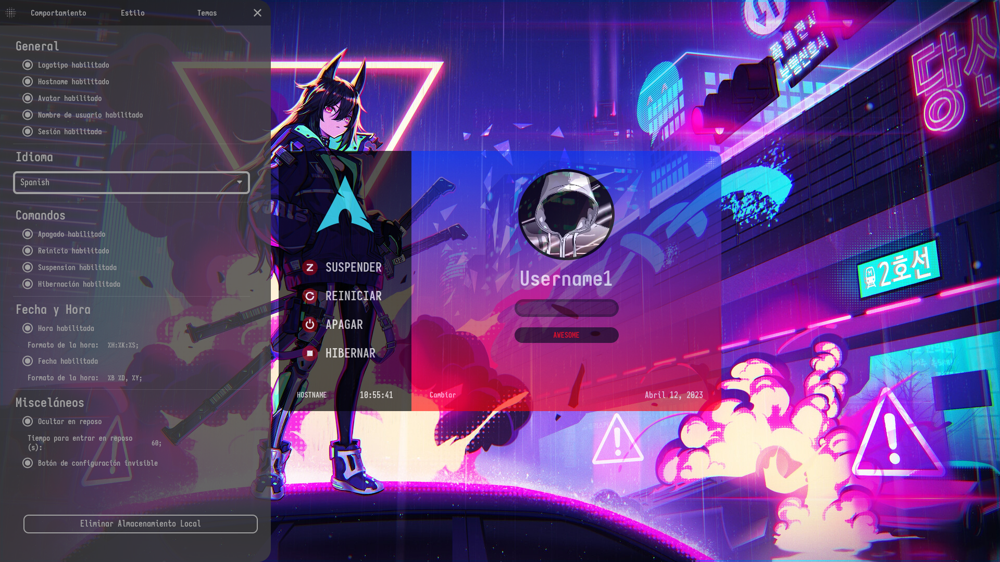
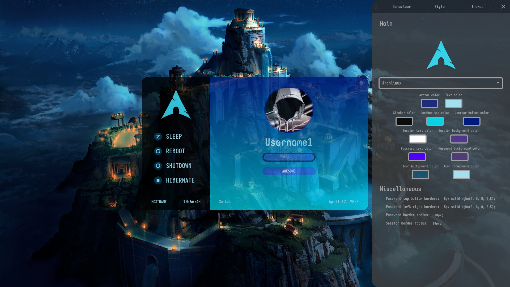
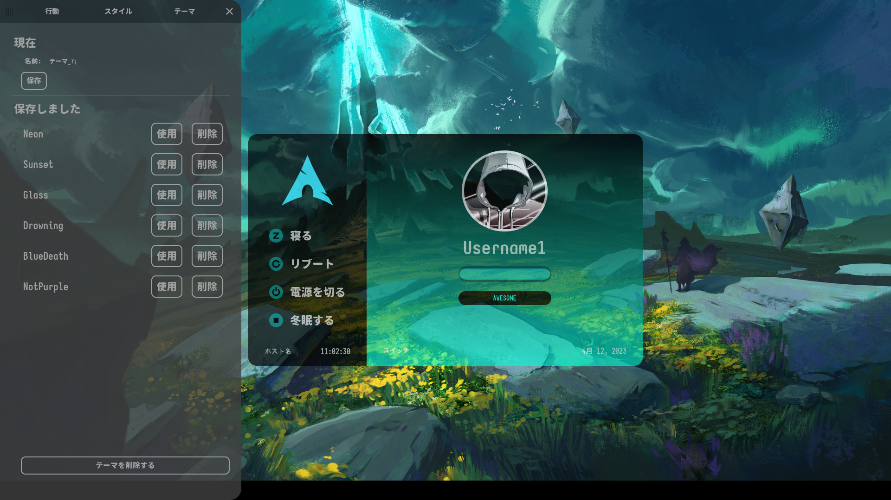
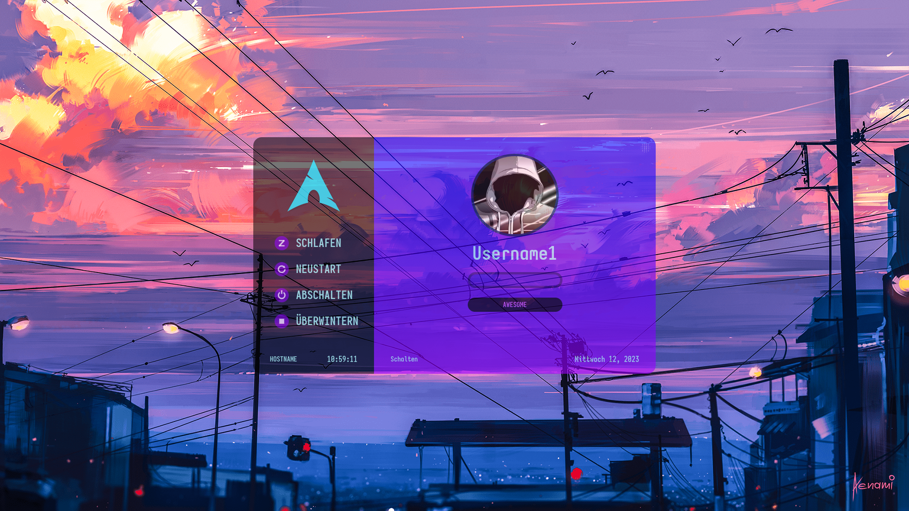

<h1 align="center">Shikai</h1>

    

Modern lightdm webkit2 theme

<h2 align="center">Index</h2>

    
  [Description][description]
  
  [Features][features]

  [Live Demo][livedemo]
  
  [Screenshots][screenshots]
  
  [Install][install]

  [Uninstall][uninstall]

  [Update][update]

  [Configuration][configuration]

  [Working Environment][working-environment]
  
  [Dependencies][dependencies]

  [Contributions][contributions]

  [Translations][translations]

  [Discussions][discussions]

  [Notes][notes]

  [Troubleshooting][troubleshooting]

  [Metrics][metrics]

  [License][license]
  
  [Code of Conduct][coc]
  
  [Author][author]

<h2 align="center">Description [<a href="https://github.com/TheWisker/Shikai#index">↑</a>]</h2>

Sleek <b>lightdm webkit2 theme</b> that focuses on looks with performance in mind

<h2 align="center">Features [<a href="https://github.com/TheWisker/Shikai#index">↑</a>]</h2>

The theme features:

- **Draggable** windows
- **Multi-monitor** support
- **Multi-language** support
- Custom **time and date** formats
- Saving configurations as **sub-themes**
- Background **shuffle** on background click
- **Sleek animations** and **on-hover effects**
- Graphical *on-theme* **style** configuration
- Graphical *on-theme* **behaviour** configuration
- **Custom backgrounds** configured via *web-greeter.yml*
- Idle login window **auto-hiding** at x seconds of inactivity
- Default **user** and **session** configured via *web-greeter.yml*
- **Background synchronization** when using the *multi-headed* mode
- **Custom user images** configured via a *.face* image on user home folders

<h2 align="center">Live Demo [<a href="https://github.com/TheWisker/Shikai#index">↑</a>]</h2>

https://thewisker.github.io/Shikai

> [!TIP]
> **Demo password**: `password`

> [!NOTE]
> Demo wallpapers do **not properly fit** on some **aspect ratios**, thus looking out of place, but that can be **fixed** when the theme is installed by **changing** the **wallpapers** for ones that have the correct aspect ratio

<h2 align="center">Screenshots [<a href="https://github.com/TheWisker/Shikai#index">↑</a>]</h2>

<h2 align="center">Install [<a href="https://github.com/TheWisker/Shikai#index">↑</a>]</h2>

There are **several** ways to **install** the *theme*, whichever you use, do not forget to also *follow* the **steps** in **General**.

<h3>General</h3>

**After** having **installed** the theme, you will need to **follow** these **steps** to get it *running*:

1. *Select* the **greeter** you are using in the `/etc/lightdm/lightdm.conf` file, which *hosts* LightDM's *configuration*:
    - Under **[Seat:\*]**, set **greeter-session** to the one you use: `greeter-session=web-greeter`
2. *Select* the **Shikai theme** in the `/etc/lightdm/web-greeter.yml` file, which *hosts* the greeter's *configuration*:
    - Under **branding**, set **theme** to shikai: `theme: shikai`
3. **Optionally**, **configure** the *environment* to your liking, as explained in [configuration][configuration]

> [!NOTE]
> You can **skip** any **step** you have **already completed** *previously*

> [!WARNING]
> When *selecting* a **greeter-session** have in mind that Shikai **only supports** [WebGreeter][web-greeter], [NodyGreeter][nody-greeter] and [SeaGreeter][sea-greeter] as *greeters*

<h3>Arch Linux</h3>

You can install **Shikai** from the [AUR][aur] repository:

- **Package** [shikai-theme][shikai-package]:

> [!TIP]
> For **information** on **how** to **install** an [AUR][aur] *package* read [this][aur-wiki] *wiki*

<h3>Script</h3>

*Follow* the **steps**:

1. **Download** and **unpack** a [release][releases] and **cd** into its **root** folder.
2. **Execute** the following **bash** script from the repo **root** directory:
    - `./scripts/install.sh`.

<h3>Manual</h3>

*Follow* the **steps**:

1. **Download** and **unpack** a [release][releases], then, **cd** into its **root** folder.
2. **Locate**, under the `dist` **directory**,  the `index.html` and `monitor.html` files.
3. In *said* files, **search** and **replace** the string `window.__is_debug = true;` with `window.__is_debug = false;`.
4. **Copy** the *contents* of the `dist` **directory** to `/usr/share/web-greeter/themes/shikai`.

<h2 align="center">Uninstall [<a href="https://github.com/TheWisker/Shikai#index">↑</a>]</h2>

The *theme* is **uninstalled** in **different ways** depending on **how** it was *installed*. 
For a **complete uninstall**, one **must** also *follow* the **steps** in **General**.

<h3>General</h3>

**After** having **uninstalled** the theme you will, **optionally**, need to **follow** some **steps** to not *lose functionality*:

- If *keeping* the **Greeter**, select **another** *theme* in the `/etc/lightdm/web-greeter.yml` file which *hosts* the greeter's *configuration*:
  - Under **branding**, set **theme** to the **new** *theme*: `theme: which-theme`
- If *removing* the **Greeter** but *keeping* **LightDM**, select **another** *greeter* in the `/etc/lightdm/lightdm.conf` file which *hosts* LightDM's *configuration*:
  - Under **[Seat:\*]**, set **greeter-session** to the **new** *greeter*: `greeter-session=which-greeter`
- If *removing* **LightDM**, make sure to set up a **new** way to **login** into the *system*.

<h3>Arch Linux</h3>

*Simply* **uninstall** the [shikai-theme][shikai-package] **package**.

<h3>Script & Manual</h3>

*Simply* **remove** the `/usr/share/web-greeter/themes/shikai` **folder**.

<h2 align="center">Update [<a href="https://github.com/TheWisker/Shikai#index">↑</a>]</h2>

To **update** the *theme* simply **install** the **new** version **overwriting** the **old** version.

> [!TIP]
> The theme **localStorage** can be **deleted** from the *on-theme* configuration

> [!CAUTION]
> Failure to **delete localStorage before** updating to a *version* which *introduces* **breaking changes** will result in **errors** on theme *load*

<h2 align="center">Configuration [<a href="https://github.com/TheWisker/Shikai#index">↑</a>]</h2>

<h3 align="left">On-Theme</h3>

The **configuration button** becomes avaiable by **hovering** over the **top-left corner** of the window. 
The **behaviour** and **style** settings are **saved** locally **only** when the configuration panel gets **closed**. 
The **themes** configuration gets saved on theme **creation**, **deletion** and **activation**.

> [!NOTE]
> Make sure to **delete** this **configuration** when **updating** to a Shikai *version* that *introduces* **breaking changes**

<h3 align="left">Greeter</h3>

The **configuration** for the *greeter* **resides** in `/etc/lightdm/web-greeter.yml`

Shikai **uses** the following *entries* from the configuration:

- Under `branding`:

| ***Key***                 | ***Description***                     | ***Recommended Value***                                         | ***Shikai-only*** | ***Type***   |
|---------------------------|---------------------------------------|-----------------------------------------------------------------|-------------------|--------------|
| **background_images_dir** | directory where wallpapers are stored | `/usr/share/web-greeter/themes/shikai/assets/media/wallpapers`  |                   | `str`        |
| **logo_image**            | directory where logos are stored      | `/usr/share/web-greeter/themes/shikai/assets/media/logos`       |                   | `str`        |
| **user_image**            | default image for users that lack one | `/usr/share/web-greeter/themes/shikai/assets/media/profile.jpg` |                   | `str`        |

- Under `greeter`:

| ***Key***               | ***Description***                                                         | ***Recommended Value*** | ***Shikai-only*** | ***Type***   |
|-------------------------|---------------------------------------------------------------------------|-------------------------|-------------------|--------------|
| **theme**               | greeter theme to use                                                      | `shikai`                |                   | `str`        |
| **icon_theme**          | cursor icon theme to use                                                  |                         |                   | `str`        |
| **default_user**        | default user to select initially                                          |                         | [X]               | `str`        |
| **default_session**     | default session to select initially                                       |                         | [X]               | `str`        |
| **screensaver_timeout** | blank the screen after this many seconds of inactivity                    |                         |                   | `int`        |
| **detect_theme_errors** | provide an option to load a fallback theme when theme errors are detected | `True`                  |                   | `bool`       |
| **debug_mode**          | enable debug mode for the greeter as well as greeter themes               | `False`                 |                   | `bool`       |
| **secure_mode**         | don't allow themes to make remote http requests                           | `True`                  |                   | `bool`       |

- Under `layouts`:

**List** of preferred **keyboard layouts** to use. 
Shikai **only** uses the **first** layout as, at the moment, it does **not provide** a way to **switch** layout *on-theme*.

> [!TIP]
> *Consider* using *ACLs* for a *more* **fine-grained control** over **permissions**

> [!WARNING]
> **Paths** and **assets** *loaded* by the theme must be **accessible** to the **lightdm** *system user* account with **read** and **execute** *permissions*

<h3 align="left">LightDM</h3>

**LightDM** can be *configured* to **turn on** the **numlock** by **default**:

1. **Install** [numlockx][numlockx-github]
    - ***Arch***:
      - **Install** the [numlockx][numlockx-package] *package*

          

    - ***Other***:
      - **Install** it by *other means*

          

2. Once *installed*, **edit** `/etc/lightdm/lightdm.conf`
    - Under **[Seat:\*]**, set **greeter-setup-script** to: `greeter-setup-script=/usr/bin/numlockx on`

<h2 align="center">Working Environment [<a href="https://github.com/TheWisker/Shikai#index">↑</a>]</h2>

When **developing** Shikai, one must have a *proper* **working environment** set up. 
To **initalize** said *environment*, one must have **installed** [npm][npm] and **run** `npm install`.

The *repo* comes with some **scripts** to **facilitate** the **development process**:

- To *package* the **development** *version* run `npm run dev` or `./scripts/development.sh`
- To *package* the **production** *version* run `npm run build` or `./scripts/production.sh`
- To *package* the **development** *version* on source **change** run `npm run watch` or `./scripts/watch.sh`
- To *package* the **development** *version* on source **change** and **serve** said package **locally** run `npm run server` or `./scripts/server.sh`

> [!NOTE]
> Scripts **must** be *run* from the repo's **root directory**

> [!WARNING]
> If you run `npm update` you are *almost* **guaranteed** to end up with **package breakages**, so just **don't**. 
> If you **did**, **delete** `./node_modules/` and **replace** *both* `./package.json` and `./package-lock.json` **with** the ones in the **repo**.

<h2 align="center">Dependencies [<a href="https://github.com/TheWisker/Shikai#index">↑</a>]</h2>

<h3 align="left">Buildtime</h3>

The **theme** *buildtime* dependencies are **listed** in the `./package.json` file.

<h3 align="left">Runtime</h3>

The **theme** *depends* on [web-greeter][web-greeter], [nody-greeter][nody-greeter] or [sea-greeter][sea-greeter] and its **respective** dependencies, plus [lightdm][lightdm].

<h2 align="center">Contributions [<a href="https://github.com/TheWisker/Shikai#index">↑</a>]</h2>

First and foremost, **all** *contributions* are **welcome**! 
The **steps** involved when making a *contribution* are **explained** in the [CONTRIBUTING.md][contributing] file. 
We *look forward* to your contributions!

- The **contributors** list is located [here][contributors].

<h2 align="center">Translations [<a href="https://github.com/TheWisker/Shikai#index">↑</a>]</h2>

First and foremost, as with contributions, **all** *translations* are also **welcome**! 
The **steps** involved when making a *translation* are **explained** in the [CONTRIBUTING.md][contributing] file. 
More **specific steps** can be found in the [CONTRIBUTING.md][lang-contributing] file in the `/src/lang` folder. 
We *look forward* to your translations!

- The **translators** list is located [here][translators].

<h2 align="center">Discussions [<a href="https://github.com/TheWisker/Shikai#index">↑</a>]</h2>

The following **spaces** are *provided* to **discuss**:
- **Ideas** for *future improvements*  in [here][discussion-ideas]
- **Questions** you want to *ask* in [here][discussion-questions]
- **Screenshots** you want to *share* in [here][discussion-screenshots]

<h2 align="center">Notes [<a href="https://github.com/TheWisker/Shikai#index">↑</a>]</h2>

- Missing linux **distro** logo? **Submit** a [pull request][pull-request]!
- Missing **language**? **Submit** a [pull request][pull-request] including it in `./src/lang`! Further details [here][translations].
- Have a really cool wallpaper to **add** to the **live demo**? **Submit** a [pull request][pull-request]!
- **Undefined** behaviour when adding **non-browser-compliant** images and **non-image** files to the **wallpapers** directory

<h2 align="center">Troubleshooting [<a href="https://github.com/TheWisker/Shikai#index">↑</a>]</h2>

<h3 align="left">Profile image not loading</h3>

If you have **added** a .face **image** to you **home** folder and it does **not load** on-theme, it is probably due to a lack of **permisions** for the lightdm user on the .face **file**.
Thus, **ensure** the **image** and its **parent folder** have **read** and **execute** *permissions* for the **lightdm user**, either by having them set for *others* or by using *ACLs*.

If this does **not solve** the *issue*, you can **try** the *following* **steps**:

1. **Copy** the .face **image** to `/var/lib/AccountsService/icons/` **renaming** it to the desired user's **name**.
2. **Create** the **configuration** file `/var/lib/AccountsService/users/<username>` *if* it does **not exist**.
3. **Add** the line `Icon=/var/lib/AccountsService/icons/<username>` to the **configuration** file.

As a **last resort**, if **none** of these *solutions* **work** you can set a **default** user *image* as explained [here][configuration] **under** the Greeter *section*.

> [!NOTE]
> **Replace** *\<username\>* with the *desired* user's **username**

<h3 align="left">Incomplete loading</h3>

On the **rare case** that the demo or the theme itself only load the backgrounds or do not load the settings,  
it is most probably **due to** a recent **update** that contains changes to the **settings** JSON **structure**.  

This can be **fixed** by either:
  - Looking at the *errors* in the **developer console** and *manually* **adding** the **missing** *keys* and *values*
  - **Deleting** the page's **localStorage**

<h2 align="center">Metrics [<a href="https://github.com/TheWisker/Shikai#index">↑</a>]</h2>

  <picture>
    
  </picture>

  <picture>
    
  </picture>

<h2 align="center">License [<a href="https://github.com/TheWisker/Shikai#index">↑</a>]</h2>

  <picture>
    
  </picture>

<h2 align="center">Code of Conduct [<a href="https://github.com/TheWisker/Shikai#index">↑</a>]</h2>

 This project follows the <a href="./.github/CODE_OF_CONDUCT.md"><b>Contributor Covenant Code of Conduct</b></a>.

<h2 align="center">Author [<a href="https://github.com/TheWisker/Shikai#index">↑</a>]</h2>

    <a href="https://github.com/TheWisker">
        </img>
    </a>

<h4 align="center">TheWisker</h4>

[description]: https://github.com/TheWisker/Shikai#description-
[features]: https://github.com/TheWisker/Shikai#features-
[livedemo]: https://github.com/TheWisker/Shikai#live-demo-
[screenshots]: https://github.com/TheWisker/Shikai#screenshots-
[install]: https://github.com/TheWisker/Shikai#install-
[uninstall]: https://github.com/TheWisker/Shikai#uninstall-
[update]: https://github.com/TheWisker/Shikai#update-
[configuration]: https://github.com/TheWisker/Shikai#configuration-
[working-environment]: https://github.com/TheWisker/Shikai#working-environment-
[dependencies]: https://github.com/TheWisker/Shikai#dependencies-
[contributions]: https://github.com/TheWisker/Shikai#contributions-
[translations]: https://github.com/TheWisker/Shikai#translations-
[discussions]: https://github.com/TheWisker/Shikai#discussions-
[notes]: https://github.com/TheWisker/Shikai#notes-
[troubleshooting]: https://github.com/TheWisker/Shikai#troubleshooting-
[metrics]: https://github.com/TheWisker/Shikai#metrics-
[license]: https://github.com/TheWisker/Shikai#license-
[coc]: https://github.com/TheWisker/Shikai#code-of-conduct-
[author]: https://github.com/TheWisker/Shikai#author-

[aur]: https://aur.archlinux.org/
[aur-wiki]: https://wiki.archlinux.org/title/Arch_User_Repository

[releases]: https://github.com/TheWisker/Shikai/releases/

[npm]: https://www.npmjs.com/
[shikai-package]: https://aur.archlinux.org/packages/shikai-theme

[lightdm]: https://github.com/canonical/lightdm
[web-greeter]: https://github.com/JezerM/web-greeter
[nody-greeter]: https://github.com/JezerM/nody-greeter
[sea-greeter]: https://github.com/JezerM/sea-greeter

[numlockx-github]: https://github.com/rg3/numlockx
[numlockx-package]: https://archlinux.org/packages/extra/x86_64/numlockx

[discussion-ideas]: https://github.com/TheWisker/Shikai/discussions/categories/ideas
[discussion-questions]: https://github.com/TheWisker/Shikai/discussions/categories/q-a
[discussion-screenshots]: https://github.com/TheWisker/Shikai/discussions/2#discussion-5044383

[contributing]: ./CONTRIBUTING.md
[contributors]: ./CONTRIBUTORS.md
[lang-contributing]: ./src/lang/CONTRIBUTING.md
[translators]: ./src/lang/credits.js
[pull-request]: https://github.com/TheWisker/Shikai/pulls

